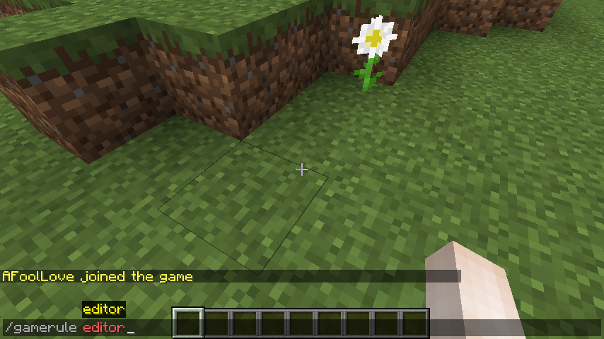
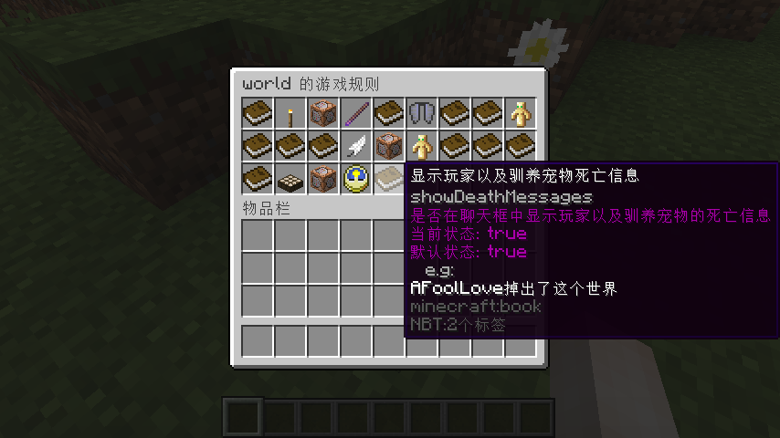

# RuleEditor  
支持版本： ```1.13 - 1.15.2```  
构建环境 ：```java 8、craftbukkit 1.15.2```

## 描述  
```RuleGame``` 可以以物品GUI的方式修改世界的游戏规则（gamerule）  
- GUI的操作方式  
```SHIFT + 鼠标左键``` 切换布尔值或增加整数值（+1）  
```SHIFT + 鼠标右键``` 减少整数值（-1）  
```鼠标中间``` 关闭GUI并启动自定义值会话，聊天框设置指定值（15秒内输入）  
```Q键（丢出物品）``` 恢复值为默认值  
GUI物品信息可根据规则自定义

# 命令  
命令插入到原版的命令中，权限依赖于原版权限  
```/gamerule editor``` 打开编辑当前世界规则的GUI  
```/gamerule editor reload``` 重新加载配置文件  
```/gamerule editor help``` 显示命令和GUI操作方式  
```/gamerule editor [world]``` 打开编辑指定世界规则的GUI ```[world]``` 为世界名称

# 配置文件  
```config.yml```  
规则描述来源于 [WIKI](https://minecraft-zh.gamepedia.com/%E5%91%BD%E4%BB%A4/gamerule)  
默认配置为已写好的一个通过 WIKI 规则的描述（虽然不好看）

```yaml
# 支持 & 转 §
# 仅支持单个变量 '%WORLD_NAME%
rules-title: '%WORLD_NAME% 的游戏规则'

# GUI 格子大小，0 或小于规则数量为自适应，最大为 6(6*9)
rules-row: 3

# 支持 & 转 §
# 变量 %RULE% 当前规则名称
# 变量 %WORLD_NAME% 世界名
# 变量 %VALUE% 当前规则的值
# 变量 %DEFAULT_VALUE% 当前规则的默认值
# 变量 %PLAYER% 当前玩家
# 支持以上变量的节点
# rules.<rule>.title
# rules.<rule>.description

rules:
  # rule 为规则名称
  <rule>:
    # 该规则的物品显示名称
    title: '§f%RULE%'
    # 该规则的物品类型，book 为 书
    item: 'book'
    # 该规则的物品描述
    description:
      - '§7%RULE%'
```

# 图片  
```*图中游戏版本为1.13```  



# Copyright  
```Copyright (c) 2020. InShin. All rights reserved.```
